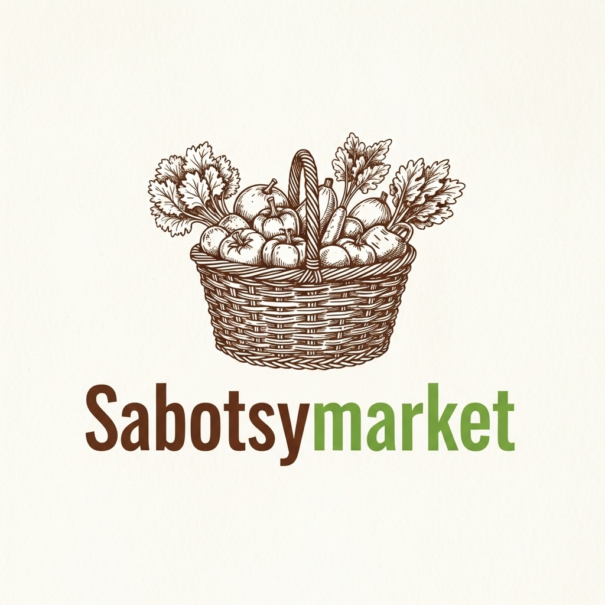

<div align="center">
  
  <h1>SabotsyMarket</h1>
  <p>
    A modern, feature-rich web platform connecting local producers with fresh-food enthusiasts.
  </p>
  <p>
    
    
    
    
  </p>
</div>

---

## 🌟 About The Project

**SabotsyMarket** is an e-commerce application designed to bridge the gap between local farmers,and consumers. It provides a beautiful, intuitive, and responsive marketplace for discovering and purchasing local goods.

The entire application is built with a focus on clean architecture, scalability, and a high-quality user experience, making the codebase as impressive under the hood as it is on the screen.

## ✨ Key Features

- **Intuitive Product Discovery**: A seamless interface for customers to browse, search, and filter products.
- **Intelligent Search**: Misspelled an item? No problem. Our smart search, powered by the **Levenshtein distance algorithm**, provides typo-tolerant results to help users find exactly what they're looking for.
- **Producer Dashboards**: A dedicated space for producers to manage their product listings, track inventory, and view orders.
- **Modern, Responsive UI**: Crafted with **shadcn/ui**, **Tailwind CSS**, and **Framer Motion** for a sleek, accessible, and animated user experience on any device.
- **Robust Architecture**: Built using Domain-Driven Design (DDD) principles with a clear separation of concerns (`domain`, `application`, `presentation`), and Dependency Injection with **InversifyJS** for a truly decoupled and testable codebase.
- **Advanced State Management**: Context API for state handling.
- **Seamless Cart & Checkout**: An easy-to-use shopping cart and a streamlined ordering process.

## 🛠️ Tech Stack

This project is built with a modern and powerful tech stack:

- **Core**: React, TypeScript, Vite
- **Styling**: Tailwind CSS, shadcn/ui, Radix UI
- **Routing**: React Router
- **State Management**: Context API
- **Forms**: React Hook Form with Zod for validation
- **Animation**: Framer Motion, AOS
- **Icons**: Lucide React
- **Linting/Formatting**: ESLint

## 🚀 Getting Started

To get a local copy up and running, follow these simple steps.

### Prerequisites

- Node.js (v18 or later)
- npm

### Installation

1.  **Clone the repository:**
    ```sh
    git clone https://github.com/Dera2Salles/SabotsyMarket.git
    ```
2.  **Navigate to the project directory:**
    ```sh
    cd LocalHarvest_Hub_frontEnd
    ```
3.  **Install NPM packages:**
    ```sh
    npm install
    ```
4.  **Start the development server:**
    ```sh
    npm run dev
    ```
    Your application should now be running on `http://localhost:5173` (or another port if 5173 is busy).

### Other Available Scripts

- **Build for production:**
  ```sh
  npm run build
  ```
- **Lint the codebase:**
  ```sh
  npm run lint
  ```
- **Preview the production build:**
  ```sh
  npm run preview
  ```

## 📂 Project Structure

The project follows a clean, domain-driven architecture to ensure separation of concerns and maintainability.

```
src/
├── application/    # Application logic, use cases, DTOs
├── assets/         # Static assets like images and fonts
├── domain/         # Core domain entities, repositories, and business rules
├── lib/            # Utility functions
├── presentation/   # React components, pages, hooks, and state (BLoC, context)
└── ...
```

---

<div align="center">
  Happy Harvesting!
</div>
